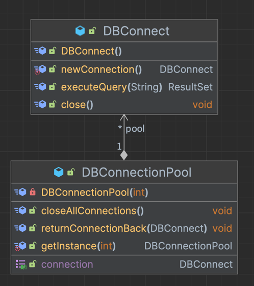
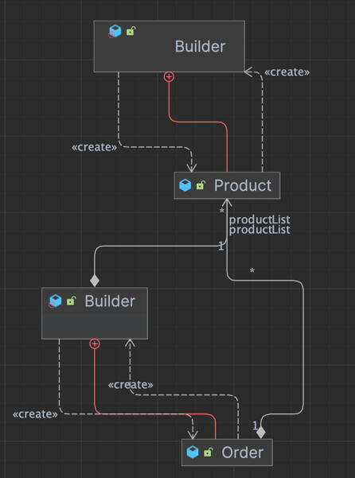
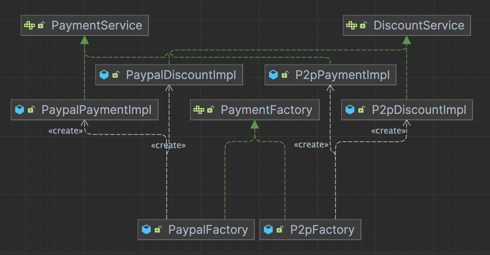
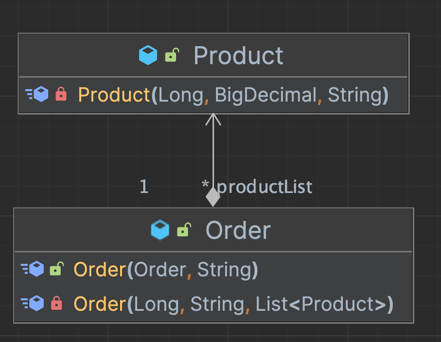

# Creational Design Patterns in Order Management System

## Project Overview

### 1. Objective
The goal of this laboratory work was to create a sample project using an object-oriented programming (OO) language and a suitable Integrated Development Environment (IDE) or editor. The project focused on implementing at least three creational design patterns to manage object instantiation within the selected domain.

### 2. Requirements
1. Use an OO language and suitable IDE (no external frameworks, libraries, or engines allowed).
2. Choose a specific domain area for the project.
3. Define the main classes involved and determine suitable instantiation mechanisms.
4. Implement at least three creational design patterns.
5. The project should be version-controlled on a Git hosting service, separated into appropriate modules and packages.

---

## Project Structure and Setup

### 1. Chosen Programming Language and IDE
- **Language**: Java
- **IDE**: IntelliJ IDEA

### 2. Domain Area
The selected domain area for the project is **Order Management**. The project simulates a system where orders can be created and managed, and it includes functionality for different payment types and discount services.

---

## Project Structure

The project is organized into the following packages:

- **domain**: Contains classes that represent the core business logic and entities for the order management system.
- **factory**: Contains factory classes responsible for creating instances of payment and discount services.
- **models**: Contains data models for the project, such as `Order` and `Product`.
- **services**: Contains service interfaces and implementations used for processing orders, applying discounts, and handling payments.
- **utils**: Contains utility classes such as `DBConnect` and `DBConnectionPool` for database management.

---

## Implementation

### Main Classes and Design Patterns

1. **Order and Product Models**:
    - Located in `domain.models`.
    - `Order` represents a customer order with fields like `id`, `description`, and a list of `Product` items.
    - `Product` represents an item in an order with fields for `id`, `name`, and `price`.

2. **Service Layer**:
    - Contains the main business logic.
    - `OrderServiceImpl`: Implements the processing of orders, including handling payments and applying discounts.

3. **Design Patterns Implemented**:
    - **Singleton Pattern**: Used for `DBConnectionPool`, ensuring a single instance of the connection pool for managing database connections.
    - **Builder Pattern**: Used in the `Order` class to allow flexible creation of `Order` instances with various configurations.
    - **Factory Pattern**: Used in the `factory` package to instantiate specific types of `PaymentService` and `DiscountService` objects based on the chosen payment method (e.g., P2P or PayPal).
    - **Prototype Pattern**: Implemented in `Order` for creating modified copies of an existing `Order` using a copy constructor.

### Detailed Explanation of Design Patterns

1. **Singleton Pattern**:
    - **Class**: `DBConnectionPool`
    - **Purpose**: Manages database connections by providing a single, shared instance of the connection pool throughout the application.
    - **Implementation**: A private constructor and a synchronized `getInstance()` method ensure only one instance of `DBConnectionPool` is created.
   
2. **Builder Pattern**:
    - **Class**: `Order`, `Product`
    - **Purpose**: Allows flexible creation of `Order` instances with a fluent API, enabling customization of fields such as `id`, `description`, and `productList`.
    - **Implementation**: A nested `Builder` class provides `set` methods for each field, with a final `build()` method that returns the constructed `Order` instance.
   
3. **Factory Pattern**:
    - **Classes**: `PaymentFactory`, `P2pFactory`, `PaypalFactory`
    - **Purpose**: Provides a way to create different implementations of `PaymentService` and `DiscountService` depending on the payment type (e.g., P2P or PayPal).
    - **Implementation**: The `PaymentFactory` interface defines methods for creating `PaymentService` and `DiscountService`. `P2pFactory` and `PaypalFactory` are concrete implementations that instantiate the respective services.
   

4. **Prototype Pattern**:
    - **Class**: `Order`
    - **Purpose**: Enables the creation of modified copies of an existing `Order` instance using a copy constructor, particularly useful for creating different types of invoices (e.g., manager vs. customer invoice).
    - **Implementation**: A copy constructor in `Order` (`public Order(Order original, String description)`) initializes a new `Order` based on the original, allowing certain fields, like `description`, to be modified while copying others, like `id` and `productList`.
   
---

## Code Snippets

### 1. Singleton Pattern in `DBConnectionPool`
```java
public class DBConnectionPool {
    private static volatile DBConnectionPool instance;
    private final Queue<DBConnect> pool = new LinkedList<>();

    private DBConnectionPool(int initialSize) {
        for (int i = 0; i < initialSize; i++) {
            pool.add(DBConnect.newConnection());
        }
    }

    public static DBConnectionPool getInstance(int initialSize) {
        if (instance == null) {
            synchronized (DBConnectionPool.class) {
                if (instance == null) {
                    instance = new DBConnectionPool(initialSize);
                }
            }
        }
        return instance;
    }
}
```
### 2. Builder Pattern in `Order`
```java
public class Order {
    private Long id;
    private String description;
    private List<Product> productList;

    private Order(Long id, String description, List<Product> productList) {
        this.id = id;
        this.description = description;
        this.productList = productList;
    }

    public static Builder builder() {
        return new Builder();
    }

    public static class Builder {
        private Long id;
        private String description;
        private List<Product> productList;
        
        private Builder() {
        }

        public Builder setId(Long id) {
            this.id = id;
            return this;
        }

        public Builder setDescription(String description) {
            this.description = description;
            return this;
        }

        public Builder setProductList(List<Product> productList) {
            this.productList = productList;
            return this;
        }

        public Order build() {
            return new Order(id, description, productList);
        }
    }
}
```
### 3. Factory Pattern in `PaymentFactory`
```java
public interface PaymentFactory {
    PaymentService createPaymentService();
    DiscountService createDiscountService();
}

public class P2pFactory implements PaymentFactory {
    @Override
    public PaymentService createPaymentService() {
        return new P2pPaymentImpl();
    }

    @Override
    public DiscountService createDiscountService() {
        return new P2pDiscountImpl();
    }
}
```

### 4. Prototype Pattern in `Order` using Copy Constructor
```java
public class Order {
    private Long id;
    private String description;
    private List<Product> productList;

    // Original constructor
    private Order(Long id, String description, List<Product> productList) {
        this.id = id;
        this.description = description;
        this.productList = productList;
    }

    // Copy constructor for prototype pattern
    public Order(Order original, String description) {
        this.id = original.id;
        this.productList = original.productList;
        this.description = description;
    }

    // Getters and other methods
}
```

## Conclusion
This laboratory work provided hands-on experience in applying creational design patterns in an object-oriented project. By using Singleton, Builder, Factory, and Prototype patterns, the project demonstrates a flexible, maintainable, and modular approach to managing object creation in Java.
The structured code organization and use of design patterns also make the project extensible, allowing future modifications with minimal impact on existing functionality.

