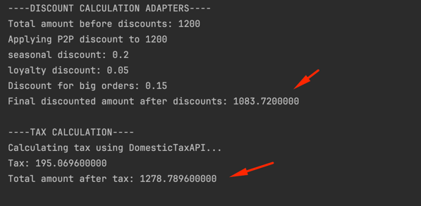
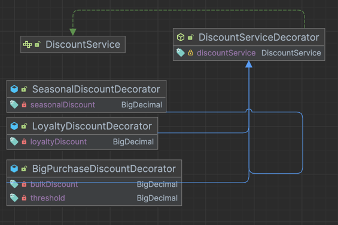
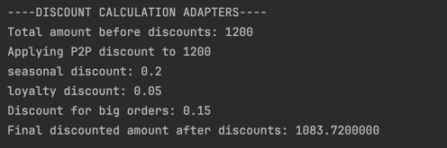
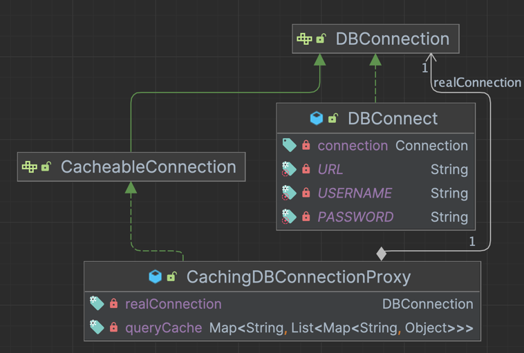
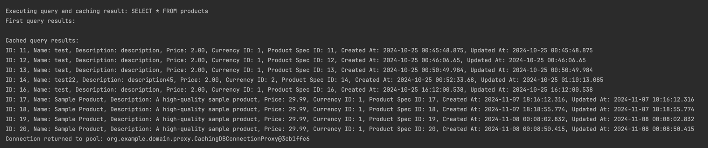
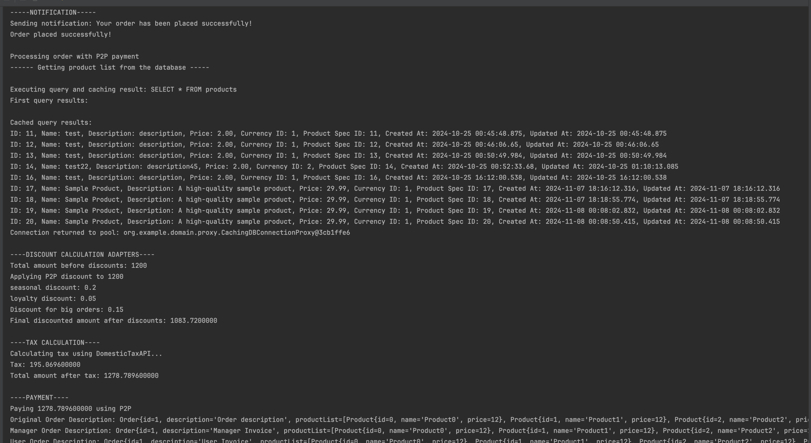

# Laboratory Work: Implementation of Structural Design Patterns

## **Author**: Smelov Eduard

---

## **1. Objectives**
1. Get familiar the Structural Design Patterns.
2. Identify the functionalities required for the current project.
3. Implement at least 3 structural design patterns to enhance system functionality.

---

## **2. Implemented patterns**
- **Adapter**
- **Facade** 
- **Decorator**
- **Proxy**

---

## **3. Implementation and Explanation**

### **3.1 Project Structure**
```plaintext
java/
|-- org.example
    |-- domain/
        |-- adapters/
            |-- DomesticTaxAdapter.java
            |-- DomesticTaxAPI.java
            |-- InternationalTaxAdapter.java
            |-- InternationalTaxAPI.java
            |-- TaxCalculator.java
        |-- decorators/
            |-- BigPurchaseDiscountDecorator.java
            |-- DiscountServiceDecorator.java
            |-- LoyaltyDiscountDecorator.java
            |-- SeasonalDiscountDecorator.java
        |-- factory/
            |-- P2pFactory.java
            |-- PaymentFactory.java
            |-- PaypalFactory.java
        |-- models/
            |-- Order.java
            |-- Product.java
        |-- proxy/
            |-- CacheableConnection.java
            |-- CachingDBConnectionProxy.java
            |-- DBConnect.java
            |-- DBConnection.java
            |-- DBConnectionPool.java
    |-- services/
        |-- impl/
            |-- InventoryServiceImpl.java
            |-- NotificationServiceImpl.java
            |-- OrderServiceImpl.java
            |-- P2pDiscountImpl.java
            |-- P2pPaymentImpl.java
            |-- PaypalDiscountImpl.java
            |-- PaypalPaymentImpl.java
        |-- DiscountService.java
        |-- InventoryService.java
        |-- NotificationService.java
        |-- OrderService.java
        |-- PaymentService.java
    |-- utils/
        |-- OrderFacade.java
        |-- OrderUtils.java
        |-- ResultSetUtils.java
    |-- Main.java
```

### **3.2 Implementation **
- **Adapter** - used to adapt international and domestic taxes during the payment process.
    In my code, I have two different tax calculation services: `DomesticTaxAPI` and `InternationalTaxAPI`.
    I have created two adapters: `DomesticTaxAdapter` and `InternationalTaxAdapter` that implement the `TaxCalculator` interface.
    After that, I can use the `TaxCalculator` interface to calculate taxes for both domestic and international orders. This way, I can easily switch between different tax calculation services without changing the code in the `OrderService` class.
- This pattern allows me to adapt the interface of the `DomesticTaxAPI` and `InternationalTaxAPI` classes to the `TaxCalculator` interface without changing the code in the `OrderService` class.
   ```java
  // Main.java
   TaxCalculator domesticTaxCalculator = new DomesticTaxAdapter(new DomesticTaxAPI());
  // OrderServiceImp.java
   BigDecimal tax = taxCalculator.calculateTax(finalAmount);
   BigDecimal totalWithTax = finalAmount.add(tax);
  ```
  
- **Facade** - used to simplify the process of creating an order.
I have created an `OrderFacade` class that contains methods for checking the availability of products, creating an order, and sending notifications to the customer.
This way, I can hide the complexity of the order creation process from the client code.
- This pattern allows me to create an order with a single method call without worrying about the details of the order creation process.
   ```java
   // 1. check if product is in stock
        order.getProductList().stream()
                .filter(product -> !inventoryService.checkStock(product.getId()))
                .forEach(product -> {
                    System.out.println("Product is out of stock!");
                    notificationService.sendNotification("Product " + product.getName() + " is out of stock!");
                    throw new RuntimeException("Product " + product.getName() + " is out of stock!");
                });

        System.out.println("\n-----PROCESSING ORDER-----");
        // 2. process order
        orderService.processOrder(order);

        System.out.println("\n-----NOTIFICATION-----");
        // 3. notify user
        notificationService.sendNotification("Your order has been placed successfully!");
    ```
- **Decorator** - used to add discounts to the order. I have created a `DiscountServiceDecorator` interface that extends the `PaymentService` interface.
Then I have created concrete decorator classes that implement the `DiscountServiceDecorator` interface and add different types of discounts to the order.
For instance, the `BigPurchaseDiscountDecorator` class adds a discount for orders with a total amount greater than 1000. 
Moreover, the `LoyaltyDiscountDecorator` class adds a discount for loyal customers. But the `SeasonalDiscountDecorator` class adds a discount for orders placed during the holiday season.
- This pattern allows me to add different types of discounts to the order without changing the code in the `OrderService` class.
   ```java
   DiscountService decoratedDiscount = new BigPurchaseDiscountDecorator(
                new LoyaltyDiscountDecorator(
                        new SeasonalDiscountDecorator(
                                discountService,
                                BigDecimal.valueOf(0.2)
                        ),
                        BigDecimal.valueOf(0.05)
                ),
                BigDecimal.valueOf(0.15),
                BigDecimal.valueOf(500)
        );
   ```
  
  
- **Proxy** - used to cache database connections. I have created a CachingDBConnectionProxy class that implements the DBConnection interface.
it caches the database connection and reuses it for subsequent requests. This approcush is used nowadays in many applications to improve performance. (e.g. Spring Data JPA, Hibernate, etc.)
   ```java
    if (conn instanceof CacheableConnection cacheableConn) {
                List<Map<String, Object>> cachedData = cacheableConn.getCachedData("SELECT * FROM products");
                System.out.println("\nCached query results:");
                if (cachedData != null) {
                    ResultSetUtils.printCachedResultSet(cachedData);
                } else {
                    System.out.println("No cached data found for query: SELECT * FROM products");
                }
            }
    ```
  So, if the query has been executed before, the proxy will return the cached data instead of executing the query again. 
  We have to check instance of `CacheableConnection` to get the cached data. 



### **3.3 Results and Conclusions**
As we can see from the output, we have a different calls from our Facade (eg. "---NOTIFICAITON---", "---TAX CALCULATION---", "---PAYMENT---", etc )
that proves that our Facade is working correctly. Moreover, we have a cached data from our Proxy (eg. "Cached query results:"). Our proxy adds a caching layer to the database connection and reuses the connection for subsequent requests. 
Finally, we have a different discounts from our Decorator (eg. "Big purchase discount", "Loyalty discount", "Seasonal discount").
