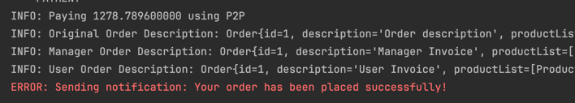

# Laboratory Work: Implementation of Behavioral Design Patterns

## **Author**: Smelov Eduard

---

## **1. Objectives**
1. Get familiar the Behavioral Design Patterns.
2. Identify the functionalities required for the current project.
3. Implement at least 1 pattern to enhance system functionality.

---

## **2. Implemented patterns**
- **Chain of Responsibility**
- **Observer**

---

## **3. Implementation and Explanation**

### **3.1 Project Structure**
```plaintext
java/
|-- org.example
    |-- domain/
       |-- adapters/
            |-- DomesticTaxAdapter.java
            |-- DomesticTaxAPI.java
            |-- InternationalTaxAdapter.java
            |-- InternationalTaxAPI.java
            |-- TaxCalculator.java
        |-- decorators/
            |-- BigPurchaseDiscountDecorator.java
            |-- DiscountServiceDecorator.java
            |-- LoyaltyDiscountDecorator.java
            |-- SeasonalDiscountDecorator.java
        |-- factory/
            |-- P2pFactory.java
            |-- PaymentFactory.java
            |-- PaypalFactory.java
        |-- loggerChain/
            |-- AbstractLogger.java
            |-- ErrorLogger.java
            |-- FileLogger.java
            |-- InfoLogger.java
            |-- Logger.java
            |-- LoggerChain.java
            |-- LogLevel.java
        |-- models/
            |-- Order.java
            |-- Product.java
        |-- observer/
            |-- InventoryObserver.java
            |-- NotificationObserver.java
            |-- ObservableOrderService.java
            |-- Observer.java
        |-- proxy/
            |-- CacheableConnection.java
            |-- CachingDBConnectionProxy.java
            |-- DBConnect.java
            |-- DBConnection.java
            |-- DBConnectionPool.java
    |-- services/
        |-- impl/
            |-- InventoryServiceImpl.java
            |-- NotificationServiceImpl.java
            |-- OrderServiceImpl.java
            |-- P2pDiscountImpl.java
            |-- P2pPaymentImpl.java
            |-- PaypalDiscountImpl.java
            |-- PaypalPaymentImpl.java
        |-- DiscountService.java
        |-- InventoryService.java
        |-- NotificationService.java
        |-- OrderService.java
        |-- PaymentService.java
    |-- utils/
        |-- OrderFacade.java
        |-- OrderUtils.java
        |-- ResultSetUtils.java
    |-- Main.java
```

### **3.2 Implementation**
- **Chain of Responsibility** - used to log messages based on their severity. I have created a `Logger` interface that contains a method for logging messages.
  Then I have created concrete logger classes that implement the `Logger` interface and log messages with different levels of severity.
  For instance, the `InfoLogger` class logs messages with the INFO level, the `ErrorLogger` class logs messages with the ERROR level, and the `FileLogger` class logs messages to a file with DEBUG level.
  Finally, I have created a `LoggerChain` class that chains the logger classes together and passes the message to the next logger in the chain if the current logger cannot handle it.
- This pattern allows me to log messages with different levels of severity without changing the code.
   ```java
    LoggerChain loggerChain = new LoggerChain();
          loggerChain.addLogger(new InfoLogger(LogLevel.INFO));
          loggerChain.addLogger(new ErrorLogger(LogLevel.ERROR));
          loggerChain.addLogger(new FileLogger(LogLevel.DEBUG));
    
          loggerChain.logMessage(LogLevel.INFO, "This is an information message.");
          loggerChain.logMessage(LogLevel.ERROR, "This is an error message.");
          loggerChain.logMessage(LogLevel.DEBUG, "This is a debug message.");
    ```
  
- **Observer** - used to notify users when the order is placed and when the product is out of stock. I have created an `Observer` interface that contains a method for updating the observer.
  Then I have created concrete observer classes that implement the `Observer` interface and update the observer with different types of notifications.
  For instance, the `NotificationObserver` class sends a notification to the user when the order is placed, and the `InventoryObserver` class sends a notification when the product is out of stock.
  Finally, I have created an `ObservableOrderService` class that maintains a list of observers and notifies them when the order is placed or when the product is out of stock.
- This pattern allows me to notify users when the order is placed and when the product is out of stock without changing the code in the `OrderService` class.
   ```java
    ObservableOrderService observableOrderService = new ObservableOrderService();
          observableOrderService.addObserver(new NotificationObserver());
          observableOrderService.addObserver(new InventoryObserver());
    
          observableOrderService.placeOrder(order);
    ```
  

### **3.3 Results and Conclusions**
As we can see from the output, we can see the INFO, ERROR, and DEBUG messages being logged by the logger chain, moreover DEBUG messages are being written to the file.
Also, we can see that the user is being notified when the order is placed and when the product is out of stock.


